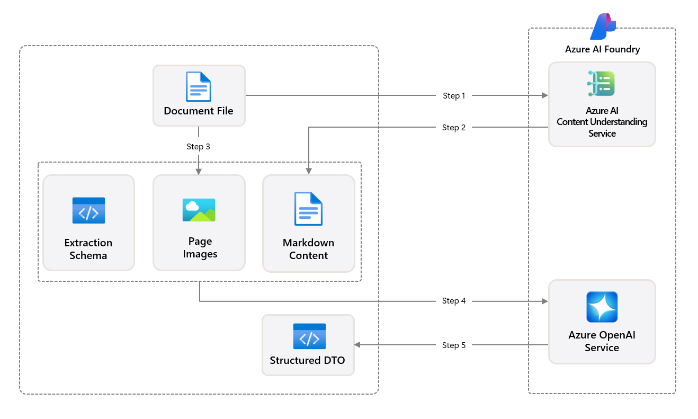

# JobFit AI Matchmaker


## AI-powered resume-to-job matching using Azure AI, OpenAI, and semantic search

[](https://opensource.org/licenses/MIT)
[](https://azure.microsoft.com)
[](https://www.typescriptlang.org/)
[](https://www.python.org)


## 🔍 What is JobFit AI Matchmaker?

JobFit AI Matchmaker is a proof of concept that reimagines resume-to-job matching using advanced Azure AI services. It demonstrates how to:

- **Automatically process** resumes at scale
- **Extract structured information** with high accuracy
- **Find ideal candidates** using semantic and hybrid search
- **Reduce time-to-hire** and improve match quality

## ✨ Key Features

- **Intelligent Resume Processing:** Extracts structured data from resumes using a robust pipeline powered by Azure AI Content Understanding and Azure OpenAI services
- **Advanced Search & Matching:** Combines vector embeddings and traditional filters for optimal candidate-job matching
- **Extensible Schema System:** Supports industry-specific resume extensions for healthcare, tech, and more
- **Azure AI Search Integration:** Leverages semantic search capabilities for natural language job requirement matching

## ✨ Architecture: Three Parts, One Solution

- **1. Content Processing Solution Accelerator**: The core document ingestion and processing pipeline that extracts structured data from resumes
- **2. Resume Search & Indexing**: Python scripts that transform processed resumes into searchable content in Azure AI Search
- **3. JobFit AI Matchmaker App**: A full-stack web application for finding the best candidate matches for job descriptions

## 🛠️ Document Processing Pipeline

JobFit extends the [Microsoft content-processing-solution-accelerator](https://github.com/microsoft/content-processing-solution-accelerator) with a multi-stage pipeline:

1. **Ingest resumes** via Azure AI Content Understanding and OpenAI Vision for extraction and schema mapping
2. **Structure data** into flexible Pydantic schemas
3. **Store results** in Azure Cosmos DB
4. **Generate embeddings** for structured resume content (not pictured)
5. **Index into Azure AI Search** for powerful semantic and hybrid querying (not pictured)
6. **Match resumes to jobs** using both vector similarity and traditional filters (not pictured)



## 🚀 Getting Started

1. Clone this repo:

   ```bash
   git clone https://github.com/john-carroll-sw/jobfit-ai-matchmaker.git
   cd jobfit-ai-matchmaker
   ```

2. Set up Azure resources (see `/docs/DeploymentGuide.md`)

3. Configure environment variables:
   - Copy `.env.example` to `.env` and update with your Azure resource details

4. Using the components:

### Content Processing Solution Accelerator

- Built on the [Microsoft content-processing-solution-accelerator](https://github.com/microsoft/content-processing-solution-accelerator)
- Uses an extensible [resume schema](./src/ContentProcessorAPI/samples/schemas/resume.py)
- Handles document processing and storage in Azure Cosmos DB
- Follow the setup in `/docs/DeploymentGuide.md` to configure

### Resume Search & Indexing Scripts (`scripts/` folder)

- `poc_get_all_resumes_from_cosmos.py`: Fetch processed resumes from Cosmos DB
- `poc_index_resumes_into_azure_ai_search.py` and `poc_index_all_resumes_into_azure_ai_search.py`: Embed and index resumes
- `poc_perform_azure_ai_hybrid_search.py`: Test search with a query

### JobFit AI Matchmaker App

- Frontend (`frontend/`):

  ```bash
  cd frontend
  npm install
  npm run dev
  ```

- Backend (`backend/`):

  ```bash
  cd backend
  npm install
  npm run dev
  ```

- Debug both simultaneously using VS Code with the provided [`launch.json`](./.vscode/launch.json) configuration

## 📊 Demo Scenarios

- Upload resumes and job descriptions through the UI
- See AI-processed structured data with extraction confidence scores
- Run matching queries against your resume database
- View top candidates ranked by relevance with match reasoning

## 🖼️ More Screenshots & Media

See [MEDIA_OVERVIEW.md](./media/MEDIA_OVERVIEW.md) for a gallery of screenshots and demo GIFs for both apps.

## 📝 Use Cases

- **Recruitment Teams:** Filter through thousands of applications in minutes
- **HR Departments:** Match internal candidates to new role openings
- **Career Services:** Help job seekers understand their fit for different positions
- **Workforce Planning:** Map skills across your organization to identify gaps

## 🤝 Contributing

This is an early-stage POC. Contributions, feedback, and suggestions are welcome! See [CONTRIBUTING.md](./docs/CONTRIBUTING.md).

## 📄 License

See [LICENSE](./LICENSE)
