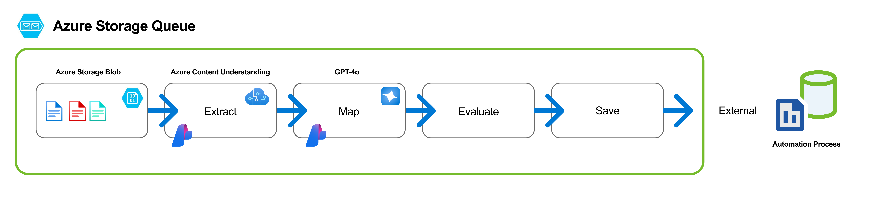

# Overview

> **Important Notice:**  
> This project is intentionally kept lean and simple, providing a hands-on experience with multimodal text extraction, search and AI reasoning techniques. While not intended for production use, it serves as a powerful starting point for exploring how it can unlock new possibilities in building smarter, more context-aware applications


## Azure AI-powered resume-to-job matching

[](https://opensource.org/licenses/MIT)
[](https://azure.microsoft.com)
[](https://www.typescriptlang.org/)
[](https://www.python.org)


## 🔍 What is JobFit AI Matchmaker?

JobFit AI Matchmaker is a proof of concept that reimagines resume-to-job matching using advanced Azure AI services. It matches resumes to a user-provided job description with high accuracy and relevance. It demonstrates how to:

- **Automatically process** resumes at scale
- **Extract structured information** with high accuracy
- **Find ideal candidates** using semantic and hybrid search
- **Reduce time-to-hire** and improve match quality

## ✨ Key Features

- **Intelligent Resume Processing:** Extracts structured data from resumes using a robust pipeline powered by Azure AI Content Understanding and Azure OpenAI services
- **Advanced Search & Matching:** Combines vector embeddings and traditional filters for optimal candidate-job matching
- **Extensible Schema System:** Supports industry-specific resume extensions for healthcare, tech, and more
- **Azure AI Search Integration:** Leverages semantic search capabilities for natural language job requirement matching

## ✨ Architecture: Three Parts, One Solution

- **1. Content Processing Solution Accelerator**: The core document ingestion and processing pipeline that extracts structured data from resumes using **`Azure OpenAI (GPT-4o)`**, **`Azure AI Foundry's Content Understanding`**, **`Azure Blob Storage`**, **`Cosmos DB`**, **`Container Apps`**, and **`Entra`**
- **2. Resume Search & Indexing**: Python scripts that transform processed resumes into searchable content in **`Azure AI Search`** using **`Azure OpenAI Text Embedding 3 Large`** for embeddings
- **3. JobFit AI Matchmaker App**: A full-stack web application that leverages **`Azure AI Search`** and **`Azure OpenAI o4-mini`** reasoning model to find the best candidate matches for job descriptions using empirical analysis scoring

## 🛠️ Document Processing Pipeline

JobFit extends the [Microsoft content-processing-solution-accelerator](https://github.com/microsoft/content-processing-solution-accelerator) with a multi-stage pipeline:

### Processing Pipeline



1. **Extract Pipeline** – Text Extraction via Azure Content Understanding.

    Uses Azure AI Content Understanding Service to detect and extract text from images and PDFs. This service also retrieves the coordinates of each piece of text, along with confidence scores, by leveraging built-in (pretrained) models.

2. **Map Pipeline** – Mapping Extracted Text with Azure OpenAI Service GPT-4o

    Takes the extracted text (as context) and the associated document images, then applies GPT-4o’s vision capabilities to interpret the content. It maps the recognized text to a predefined entity schema, providing structured data fields and confidence scores derived from model log probabilities.

3. **Evaluate Pipeline** – Merging and Evaluating Extraction Results

    Combines confidence scores from both the Extract pipeline (Azure AI Content Understanding) and the Map pipeline (GPT-4o). It then calculates an overall confidence level by merging and comparing these scores, ensuring accuracy and consistency in the final extracted data.

4. **Save Pipeline** – Storing Results in Azure Blob Storage and Azure Cosmos DB

    Aggregates all outputs from the Extract, Map, and Evaluate steps. It finalizes and saves the processed data to Azure Blob Storage for file-based retrieval and updates or creates records in Azure Cosmos DB for structured, queryable storage. Confidence scoring is captured and saved with results for down-stream use - showing up, for example, in the web UI of the processing queue. This is surfaced as "extraction score" and "schema score" and is used to highlight the need for human-in-the-loop if desired.

#### Handled by the Scripts and Jobfit AI Matchmaker Application

1. **Generate embeddings** for structured resume content
2. **Index into Azure AI Search** for powerful semantic and hybrid querying
3. **Match resumes to jobs** using both vector similarity and traditional filters

## 🚀 Getting Started

1. Clone this repo:

   ```bash
   git clone https://github.com/john-carroll-sw/jobfit-ai-matchmaker.git
   cd jobfit-ai-matchmaker
   ```

2. Set up Azure resources (see `/docs/DeploymentGuide.md`)

3. Configure environment variables:
   - Copy `.env.example` to `.env` and update with your Azure resource details

4. Sample resume dataset:
   - For testing purposes, you can use the [Kaggle resume dataset](https://www.kaggle.com/datasets/snehaanbhawal/resume-dataset)
   - This dataset provides a variety of sample resumes across different industries

5. Using the components:

    **Content Processing Solution Accelerator**

    - The document processing engine that extracts structured information from resumes with high accuracy
    - Uses Azure AI Content Understanding and GPT-4o to parse complex resume formats and layouts
    - Stores extracted data in Cosmos DB using an extensible [resume schema](./src/ContentProcessorAPI/samples/schemas/resume.py)
    - Follow the setup in `/docs/DeploymentGuide.md` to configure your Azure resources

    **Resume Search & Indexing Scripts (`scripts/` folder)**

    - Utility scripts that bridge the processing pipeline with the search functionality:
      - `poc_get_all_resumes_from_cosmos.py`: Fetch processed resumes from Cosmos DB saves to folder
      - `poc_index_all_resumes_into_azure_ai_search.py`: Embed and index resumes into Azure AI Search
      - `poc_perform_azure_ai_hybrid_search.py`: Test search index with a hybrid search query

    **JobFit AI Matchmaker App**

    - The main proof-of-concept application that matches job descriptions with candidate resumes
    - Frontend (`frontend/`):

        ```bash
        cd frontend
        npm install
        npm run dev
        ```

    - Backend (`backend/`):

        ```bash
        cd backend
        npm install
        npm run dev
        ```

        > **Tip:** Debug both frontend and backend simultaneously using VS Code with the provided [`launch.json`](./.vscode/launch.json) configuration

## 📊 Demo Scenarios

- Upload resumes and job descriptions through the UI
- See AI-processed structured data with extraction confidence scores
- Run matching queries against your resume database
- View top candidates ranked by relevance with match reasoning

## 🖼️ More Screenshots & Media

See [MEDIA_OVERVIEW.md](./media/MEDIA_OVERVIEW.md) for a gallery of screenshots and demo GIFs for both apps.

## 📝 Use Cases

- **Recruitment Teams:** Filter through thousands of applications in minutes
- **HR Departments:** Match internal candidates to new role openings
- **Career Services:** Help job seekers understand their fit for different positions
- **Workforce Planning:** Map skills across your organization to identify gaps

## 🤝 Contributing

This is an early-stage POC. Contributions, feedback, and suggestions are welcome! See [CONTRIBUTING.md](./docs/CONTRIBUTING.md).

## 📄 License

See [LICENSE](./LICENSE)
