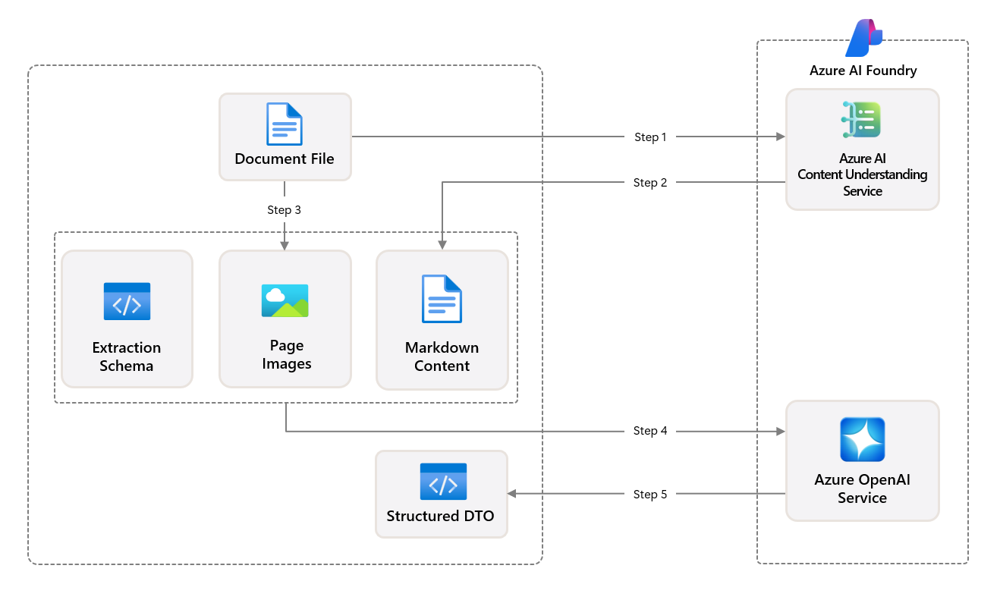

# Technical Approach

## Overview

At the application level, when a file is processed a number of steps take place to ingest, extract, and transform the contents of the file into the selected schema. The diagram above shows a step-by-step overview of the approach for processing.

1. Documents are passed with a specific schema. This request is sent to the API end point and _can include an optional set of metadata for external refencing_. This collection of data is sent to Azure AI Content Understanding Service for initial extraction of content. This utilizes a pre-built layout for extracting the data.

2. This extracted data is converted to a markdown format.

3. Images are extracted from individual pages and included with the markdown content in a second call to Azure OpenAI Vision to complete a second extraction and multiple extraction prompts relating to the schema initially selected.

4. These two extracted datasets are compared and use system level logs from Azure AI Content Understanding and Azure OpenAI Service to determine the extraction score. This score is used to determine which extraction method is the most accurate for the schema and content and sent to be transformed and structured for finalization.

5. The top performing data is used for transforming the data into its selected schema. This is saved as a JSON format along with the final extraction and schema mapping scores. These scores can be used to initiate human-in-the-loop review - allowing for manual review, updates, and annotation of changes.

## Processing Pipeline

1. **Extract Pipeline** – Text Extraction via Azure Content Understanding.

    Uses Azure AI Content Understanding Service to detect and extract text from images and PDFs. This service also retrieves the coordinates of each piece of text, along with confidence scores, by leveraging built-in (pretrained) models.

2. **Map Pipeline** – Mapping Extracted Text with Azure OpenAI Service GPT-4o

    Takes the extracted text (as context) and the associated document images, then applies GPT-4o’s vision capabilities to interpret the content. It maps the recognized text to a predefined entity schema, providing structured data fields and confidence scores derived from model log probabilities.

3. **Evaluate Pipeline** – Merging and Evaluating Extraction Results

    Combines confidence scores from both the Extract pipeline (Azure AI Content Understanding) and the Map pipeline (GPT-4o). It then calculates an overall confidence level by merging and comparing these scores, ensuring accuracy and consistency in the final extracted data. 

4. **Save Pipeline** – Storing Results in Azure Blob Storage and Azure Cosmos DB

    Aggregates all outputs from the Extract, Map, and Evaluate steps. It finalizes and saves the processed data to Azure Blob Storage for file-based retrieval and updates or creates records in Azure Cosmos DB for structured, queryable storage. Confidence scoring is captured and saved with results for down-stream use - showing up, for example, in the web UI of the processing queue. This is surfaced as "extraction score" and "schema score" and is used to highlight the need for human-in-the-loop if desired.